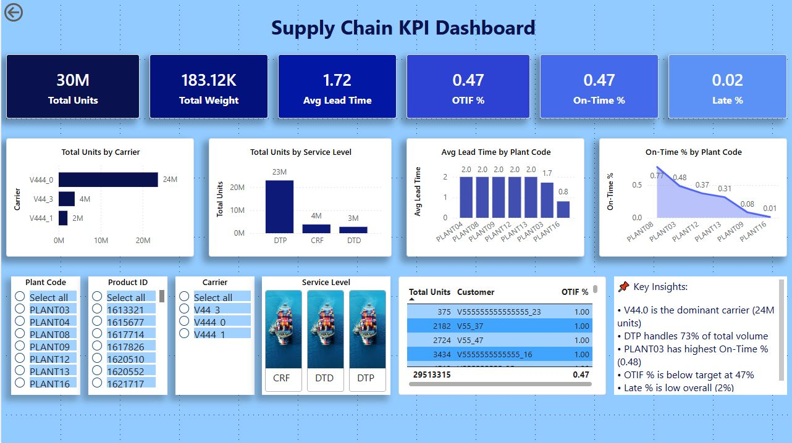

# 📊 Supply Chain KPI Dashboard (Power BI)

This project delivers a clean, interactive Power BI dashboard that visualizes key supply chain performance metrics such as OTIF, lead time, carrier performance, SKU demand, and plant-to-customer flow.

The dashboard is built using a real-world logistics dataset and follows best practices in data modeling, DAX, and visual design.

---

## ✅ Key KPIs

- **OTIF (On-Time In-Full)**
- **Average Lead Time**
- **Total Units Shipped**
- **Total Weight Shipped**
- **Carrier Performance Score**
- **Customer Order Volume**
- **SKU Demand Distribution**

---

## ✅ Dashboard Preview

---

## 📂 Download the Power BI File

Click below to download the full Power BI report:

👉 [SupplyChain_KPI_Dashboard.pbix](pbix/SupplyChain_KPI_Dashboard.pbix)

## ✅ How to Use

1. Download the `.pbix` file from `/pbix`
2. Open it in Power BI Desktop
3. Explore the dashboard using slicers and filters

---

## ✅ Files in This Repository

| Folder | Description |
|--------|-------------|
| `/data` | Dataset used for the dashboard |
| `/pbix` | Power BI file (`.pbix`) |
| `/images` | Dashboard screenshots |
| `README.md` | Project documentation |

---

## ✅ Dataset

The dataset contains real shipment records including:

- Customers  
- Products (SKUs)  
- Carriers  
- Plants  
- Origin & destination ports  
- Units shipped  
- Weight  
- Lead time  
- Delivery status  

---

## ✅ Future Enhancements

- Add forecasting visuals  
- Add cost-per-unit KPIs  
- Add anomaly detection for late shipments  

---

## ✅ Author

**Pubudu Narayana**  
Supply Chain & Data Analytics  
GitHub: https://github.com/pn-analyst
